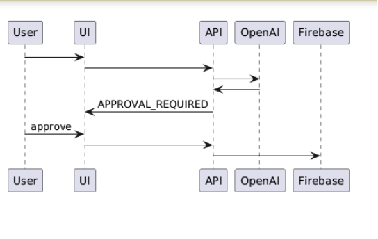

# HITL Agent Enterprise — Proyecto Final

## Arquitectura de Agente Seguro con Human-in-the-Loop

Este proyecto implementa un agente IA empresarial con:

- OpenAI Tool Calling
- Firebase Firestore
- Memoria conversacional
- Interceptor HITL
- FastAPI Backend
- Streamlit Frontend

## Flujo HITL

1. Solicitud usuario
2. Razonamiento del agente
3. Pausa humana
4. Ejecución tras aprobación

## Herramientas del Agente

El agente usa OpenAI Tool Calling con estas herramientas:

- `create_purchase_order`
  - Crea una orden de compra.
  - Busca el producto por `detail` en la colección `products`.
  - Enriquecimiento automático: `product_id`, `detail`, `unit_price`, `quantity`, `total_amount`.
  - Requiere aprobación humana (HITL).

- `delete_purchase_order`
  - Elimina una orden por `purchase_order_id`.
  - Muestra el registro objetivo antes de ejecutar.
  - Requiere aprobación humana (HITL).

- `list_purchase_orders`
  - Lista órdenes de compra (con filtros como `user_id`, `date`, `status`, `limit`).
  - No requiere aprobación humana.

## Cuándo Se Activa Human-in-the-Loop

El HITL se activa cuando la acción modifica datos críticos:

- Crear una orden de compra (`CREATE_PURCHASE_ORDER`).
- Eliminar una orden de compra (`DELETE_PURCHASE_ORDER`).

Si la consulta es solo de lectura, como listar órdenes, el agente responde directamente sin pausa humana.

## Cómo Interpretar La Pantalla De Aprobación

Cuando aparece la pantalla de aprobación en frontend:

- `Acción crítica`: tipo de operación que se va a ejecutar.
- `Impacto`: explicación del efecto en la base de datos.
- `Registro objetivo`: JSON con el registro que se creará o eliminará.

Botones:

- `Sí`: aprueba la ejecución y llama a `/execute`.
- `No`: cancela la acción; no se hacen cambios en base de datos.

Recomendación operativa:

- Verifica `user_id`, `detail`, `quantity`, `unit_price`, `total_amount` antes de aprobar creaciones.
- Verifica `purchase_order_id` y el contenido del registro antes de aprobar eliminaciones.

## Instalación

### Backend

cd backend
pip install -r requirements.txt
cp .env.example .env

Configurar:
- OPENAI_API_KEY
- firebase_key.json (descargar desde Firebase Console)

Ejecutar:
uvicorn main:app --reload

### Frontend

cd frontend
pip install -r requirements.txt
streamlit run app.py

## Firebase Setup

1. Crear proyecto en Firebase Console
2. Activar Firestore
3. Activar Authentication email/password
4. Descargar service account key
5. Guardar como backend/firebase_key.json

## Prueba HITL

- Enviar solicitud: "Crear orden de compra de 10 laptops"
- Aprobar acción
- Verificar Firestore collection purchase_orders

También puedes probar eliminación:

- Enviar solicitud: "Eliminar orden con id <purchase_order_id>"
- Revisar impacto y registro objetivo en la pantalla de aprobación
- Confirmar con `Sí` o cancelar con `No`
